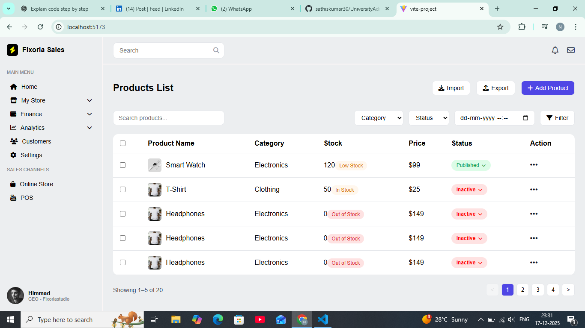

📊 Fixoria Sales Dashboard

A responsive sales dashboard built using React (Vite) that provides an intuitive sidebar navigation, header with search & notifications, and expandable menu sections for managing store operations, analytics, and sales channels.

🚀 Features

📱 Responsive Sidebar with hamburger menu (mobile support)

🔽 Expandable / Collapsible Menus (My Store, Finance, Analytics)

🔔 Header with Search, Notifications & Messages

🎨 Clean and modern UI

🧭 Smooth navigation layout

🧩 Component-based architecture

🛠️ Tech Stack

Frontend: React.js (Vite)

Styling: CSS3

Icons: Font Awesome

State Management: React Hooks (useState)

## 🖼️ Screenshots

### Dashboard View

⚙️ Installation & Setup

Clone the repository

git clone https://github.com/your-username/fixoria-sales-dashboard.git

Navigate to project directory

cd fixoria-sales-dashboard

Install dependencies

npm install

Run the development server

npm run dev
🖥️ Screens Overview

Sidebar

Home

My Store (Products, Orders, Inventory, Discount)

Finance (Payments, Invoices, Taxes)

Analytics (Sales Report, User Stats, Performance)

Customers & Settings

Header

Search bar

Notification & message icons

📌 Future Enhancements

🔐 Authentication & Role-based access

📊 Dynamic charts & analytics

🌙 Dark mode

🔗 Backend API integration

